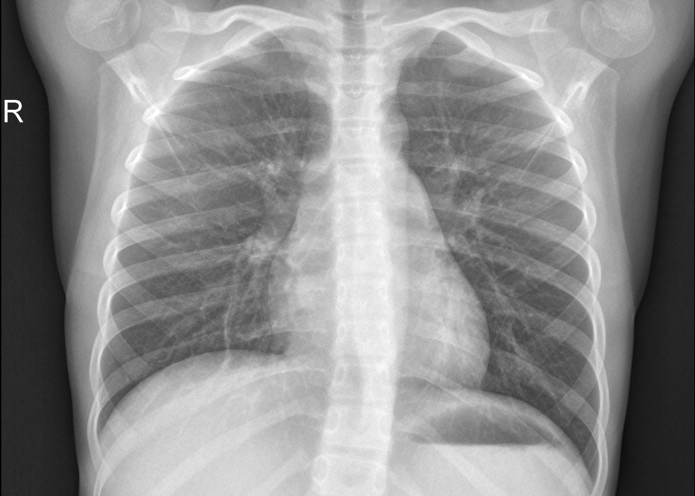

# Classification of Pneumonia Diseases using a Combination of VGG-16 and Support Vector Machine Models

This project aims to combine the advantages of deep learning techniques with VGG-16 and Support Vector Machine learning algorithms in the classification of Pneumonia diseases from radiology images. Hopefully, this project can contribute to the development of models with high and consistent accuracy in the diagnosis of pneumonia disease.

# Dataset
In this project, the data used is "Classification of COVID viral bacterial pneumonia" which
can be accessed at here→ [Dataset](hhttps://www.kaggle.com/datasets/sriramthakur/classification-of-covid-viral-bacterial-pneumonia/data) ←

This data is an x-ray image of the lungs. The dataset
consists of 3 types, namely training data, testing data and validation data. In this dataset, there
are 4 distinguishing classes, namely bacterial, viral, covid and normal classes. The total amount
of data in this dataset is 6442 images.
There are sample of data for each class
|Bacterial|Covid|
|:-:|:-:|
|||
|Normal|Viral|
|||

# Methodology
The stages of this project consist of 6 stages starting from data collection, data preprocessing, data split, feature extraction with VGG-16, SVM classification model
building and model evaluation.

Full code of this project at here [full code](https://github.com/WiseStar282/Pneumonia-classification/blob/main/Pneumonia%20Classification%20VGG%2BSVM-.ipynb)

You also can see my article about this at here [medium.com](https://medium.com/@ahmadbintangarif/classification-of-pneumonia-diseases-using-a-combination-of-vgg-16-and-support-vector-machine-e14f8adf8d3e)
